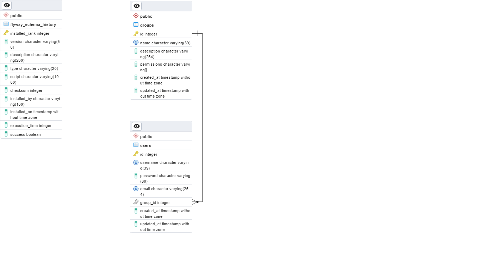

# OctoAPI

This is the API for Octopodius project.

## Technologies

[][java]
[][spring]
[][pg]

## Architecture

#### Why many DTOs?

Organization of project, architecture, and improve the security of application datas against **Mass Assignment Attack**, [read more about this cheatsheet on OWASP](https://cheatsheetseries.owasp.org/cheatsheets/Mass_Assignment_Cheat_Sheet.html).

## Infrastructure

#### Database diagram

#### Docker

##### To-do

- [ ] Create Dockerfile to run the Spring Application

#### Azure Services

- [ ] Azure Repository
- [ ] Azure PostgreSQL Database
- [ ] Azure Containers/Kubernets
- [ ] Azure KeyVault
- [ ] CI/CD and Pipelines
- [ ] Use DNS
- [ ] Use TLS/SSL certificates

[java]: https://docs.oracle.com/en/java/
[spring]: https://docs.spring.io/spring-framework/docs/current/reference/html/index.html
[pg]: https://www.postgresql.org/docs/
