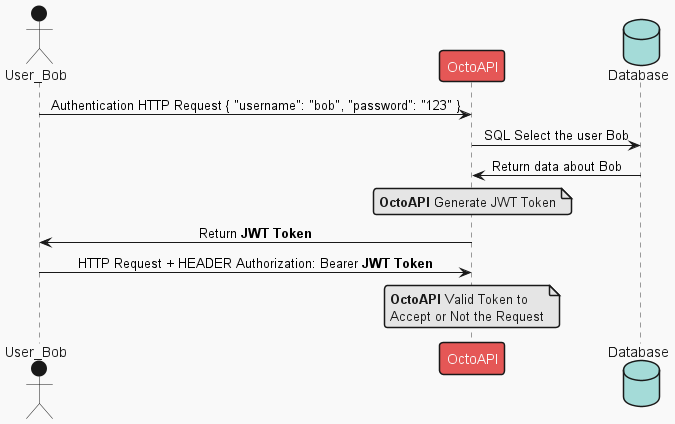
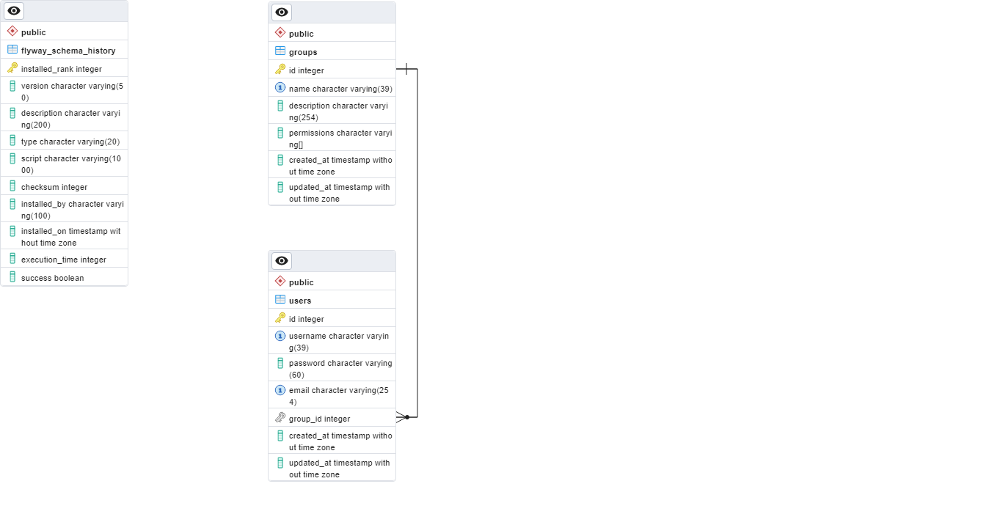

# OctoAPI

This is the API for Octopodius project.

- [0.0 Technologies](#0-technologies)
- [1.0 Architecture](#1-architecture)
  - [1.1 Why many DTOs?](#11-why-many-dtos)
  - [1.2 Authorization and Authentication](#12-authorization-and-authentication)
- [2.0 Infrastructure](#2-infrastructure)
  - [2.1 Database Diagram](#21-database-diagram)
  - [2.2 Docker](#22-docker)
  - [2.3 Cloud Services](#23-cloud-services)

## 0. Technologies

[][java]
[][spring]
[][pg]

## 1 Architecture

#### 1.1 Why many DTOs?

Organization of project, architecture, and improve the security of application datas against **Mass Assignment Attack**, [read more about this cheatsheet on OWASP](https://cheatsheetseries.owasp.org/cheatsheets/Mass_Assignment_Cheat_Sheet.html).

#### 1.2 Authorization and Authentication

###### 1.2.1 **JWT Token**

## 2. Infrastructure

#### 2.1 Database diagram

###### 2.1.1 ERD Diagram

#### 2.2 Docker

###### 2.2.1 To-Do List

- [ ] Create Dockerfile to run the Spring Application

#### 2.3 Cloud Services

###### 2.3.1 To-Do List

- [ ] Azure Repository
- [ ] Azure PostgreSQL Database
- [ ] Azure Containers/Kubernets
- [ ] Azure KeyVault
- [ ] CI/CD and Pipelines
- [ ] Use DNS
- [ ] Use TLS/SSL certificates

[java]: https://docs.oracle.com/en/java/
[spring]: https://docs.spring.io/spring-framework/docs/current/reference/html/index.html
[pg]: https://www.postgresql.org/docs/
